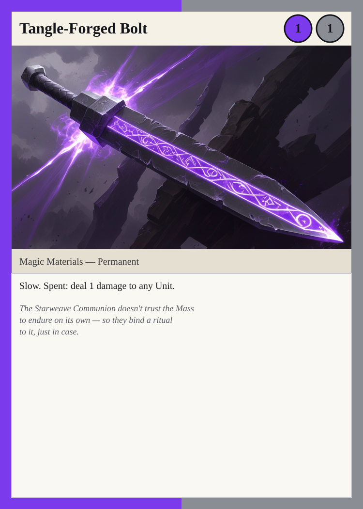
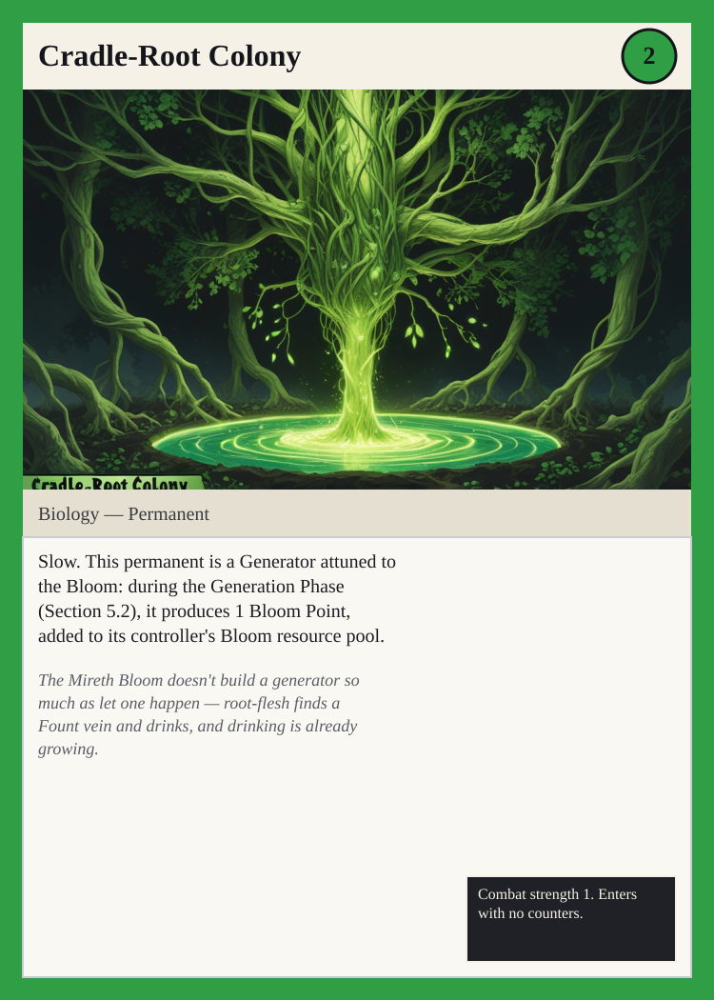

# Wreck Tangle

A trading card game of salvage, wormholes, and renegotiated fate — set in
**The Amaranth Expanse**. Designed, written, illustrated, and published by an
autonomous AI pipeline ([AgentBox](https://github.com/RouterBox)) under human
taste direction.

> **▶ Browse the game: [routerbox.github.io/cardGame](https://routerbox.github.io/cardGame/)**

| Start here | |
|---|---|
| 🎴 **[Phoenix Card Gallery](https://routerbox.github.io/cardGame/phoenix-gallery.html)** | All 44 illustrated cards |
| 📖 **[Core Rules](https://routerbox.github.io/cardGame/design/rules.html)** | The full rulebook |
| 🗂️ **[All Cards index](https://routerbox.github.io/cardGame/cards-index.html)** | Searchable card table |
| 🌌 **[The Amaranth Expanse](https://routerbox.github.io/cardGame/design/lore.html)** | World lore |
| 🎧 **[Narrated presentation](https://routerbox.github.io/cardGame/presentation/presentation.html)** | How this was built, in plain language (7½ min) |

  
  &nbsp;&nbsp;
  

## What's in this repo

- `design/` — the rulebook, card sets, races, characters, lore, star atlas,
  playtest walkthroughs, and art briefs (all plain markdown)
- `renders/cards-phoenix/` — self-contained illustrated card SVGs
  (Leonardo Phoenix 1.0 art embedded as data URIs)
- `renders/art-raw-phoenix/` — the raw 1024×616 generations
- `tools/` — the deterministic card renderer, art compositor, site builder,
  and Jaina sync
- `site/` — the generated design-shelf website (served via GitHub Pages from
  the `gh-pages` branch)
- `test/` — 848 automated checks; everything above is test-gated

*The game name puns on the Tangle — the Fount of fate — and the First Weave
wreckage the setting's salvage crews pick through. Yes, also on "rectangle."*
